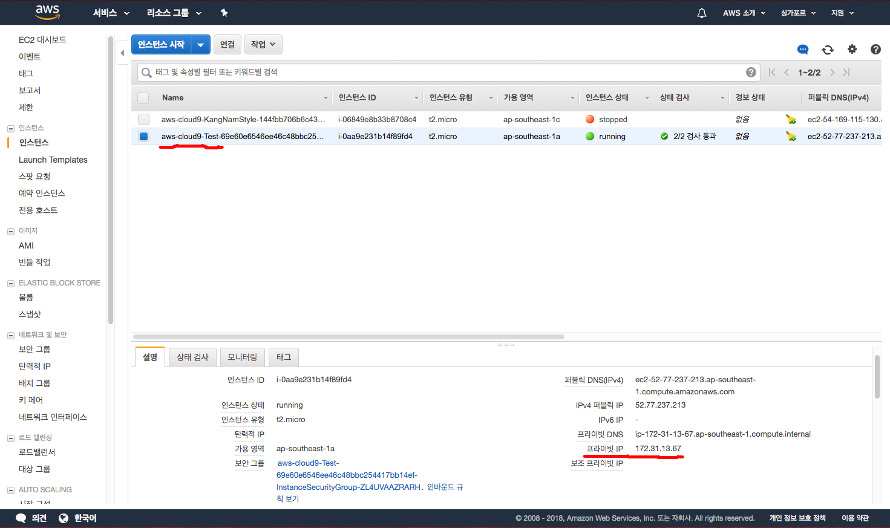
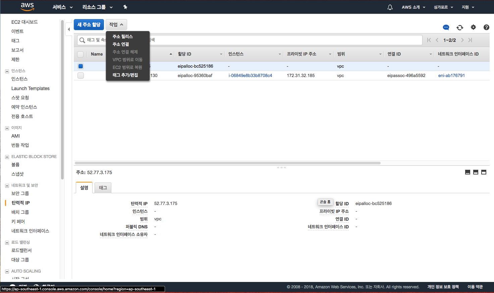
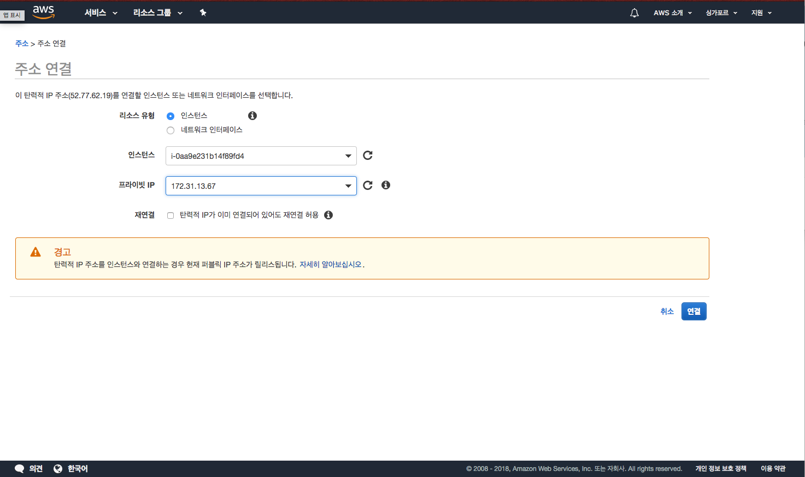
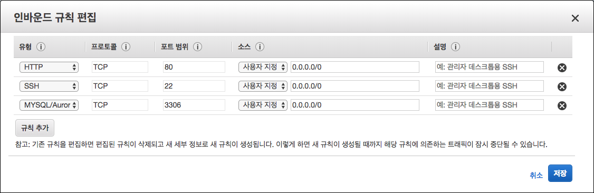

# AWS Cloud9

AWS Cloud9은 인터넷만 연결되어 있다면 웹 브라우저상으로 코드 작성 및 실행, 디버깅을 할 수 있는 클라우드 기반의 통합 개발 환경(IDE)를 의미합니다.
**Ctrl + 왼쪽마우스 클릭!**
**https://aws.amazon.com/ko/cloud9/**
 

## AWS Cloud9 생성하기 
* 싱가폴 리전 선택

* AWS Cloud9 시작하기 버튼 --> 클릭

* 지역은 싱가폴로 선택을 하도록 하겠습니다.

* Create Environment 버튼 --> 클릭
* Create a new instance for environment (EC2 설정) --> Instance Type은 t2.micro설정

* Cost-saving setting은 4시간 후 설정
* Create! 하면 조금 시간이 걸립니다...
    * 이때, 자동으로 EC2가 생성됩니다.

## EC2 Elastic IP (고정아이피 할당)
* [Ctrl + 마우스 왼쪽 버튼 클릭!](https://aws.amazon.com/ko/)
* 내계정 -> AWS Management Console-> EC2
* 좌측 Instance탭 -> 생성한 C9의 EC2 인스턴스 선택(aws-cloud9-[C9_이름] 으로 시작합니다.) -> 하단의 Private IP 확인

* NETWORK & SECURITY탭 -> 탄력적 IP -> 새 주소 할당 -> 할당하기 -> 할당된 IP클릭 -> 작업-> 주소연결클릭

* 인스턴스 -> 생성한 C9의 EC2 인스턴스 선택
* 프라이빗 IP -> 생성한 C9의 EC2 인스턴스의 Private IP 선택

## EC2 Inbound 열기
* [Ctrl + 마우스 왼쪽 버튼 클릭!](https://aws.amazon.com/ko/)
* 콘솔에 접근  -> EC2 -> NETWORK & SECURITY탭
* Security Groups
* Inbound -> Edit  -> 아래 사진과 같이 추가

실습이 완료되면 다음모듈인 [2. S3 생성하기](../2_S3) 으로 이동하십시오
