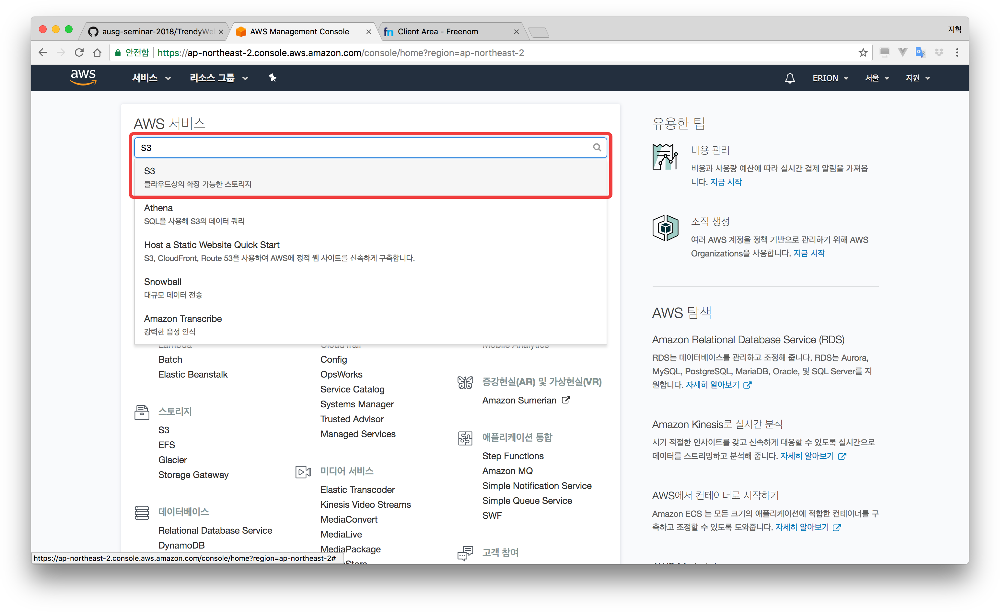
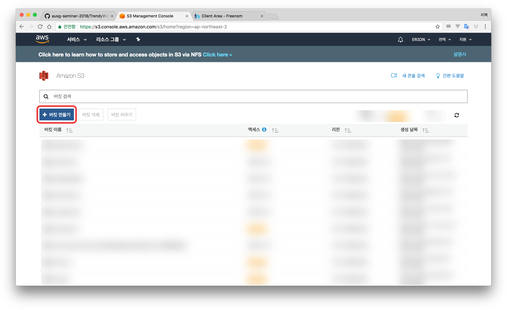
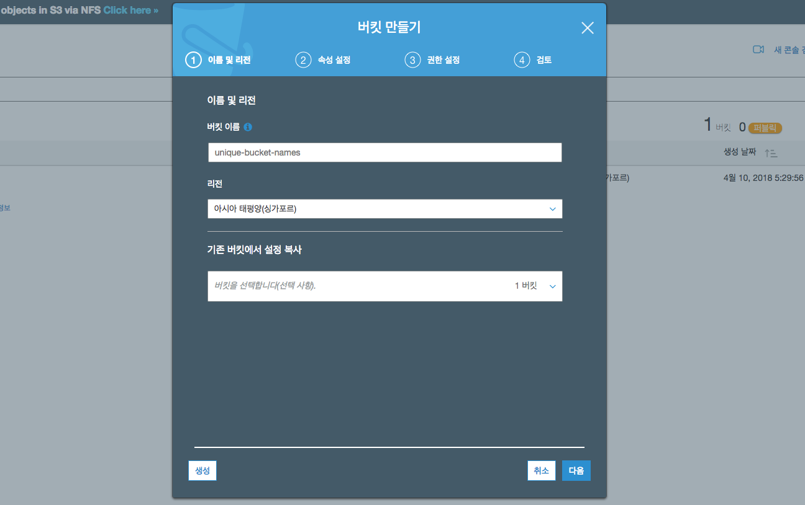
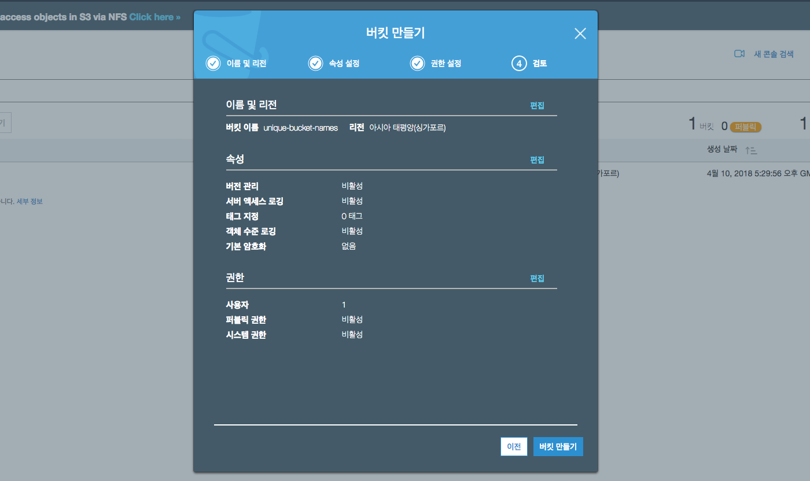
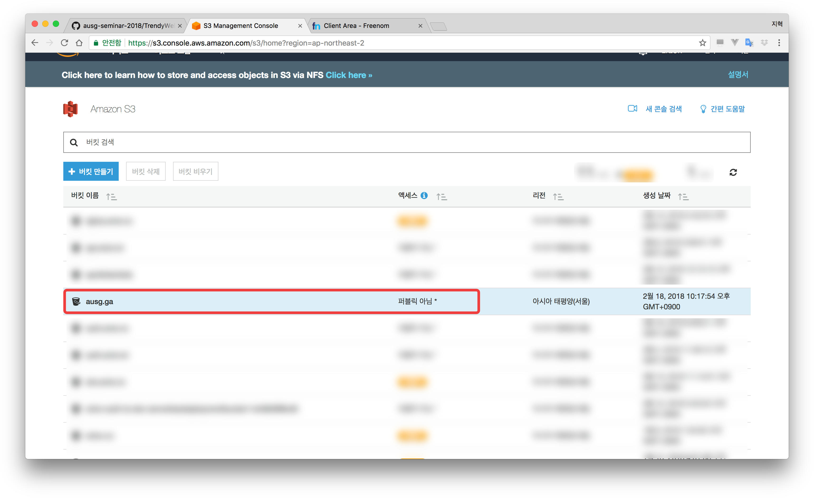
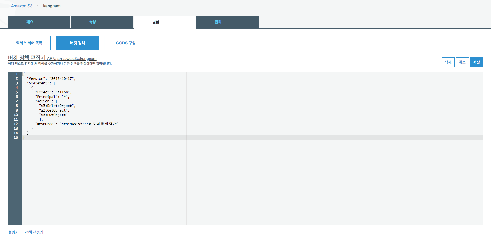

# AWS S3

## S3 생성하기
- AWS Console로 이동합니다.
- S3 서비스로 이동합니다.

- `버킷 만들기` 클릭합니다.

- 팝업 창이 뜨면, `버킷 이름`에 **고유한 이름(중복불가)** 을 입력합니다.
- 싱가포르 리전을 선택합니다.

- 모든 설정을 기본 설정 값으로 두고 `다음`을 클릭합니다. (두 번)
- `버킷 만들기` 클릭

- 만든 버킷을 클릭합니다

- `권한` 클릭
- `버킷 정책` 클릭

```json
{
  "Version": "2012-10-17",
  "Statement": [
    {
      "Effect": "Allow",
      "Principal": "*",
      "Action": [
        "s3:DeleteObject",
        "s3:GetObject",
        "s3:PutObject"
        ],
      "Resource": "arn:aws:s3:::버킷이름입력/*"
    }
  ]
}
```

- 위의 값을 복사, 붙여넣기 해주신 후 버킷 생성시 입력한 이름을 `버킷이름입력`에 넣어주세요
- `저장`을 클릭합니다.


축하드립니다! 실습이 완료셨다면, 다음 모듈인 [3. AWS RDS](../3_RDS) 으로 이동하세요.