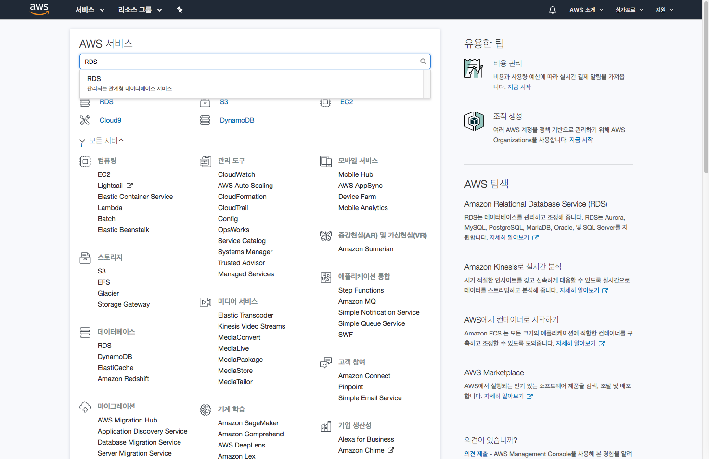
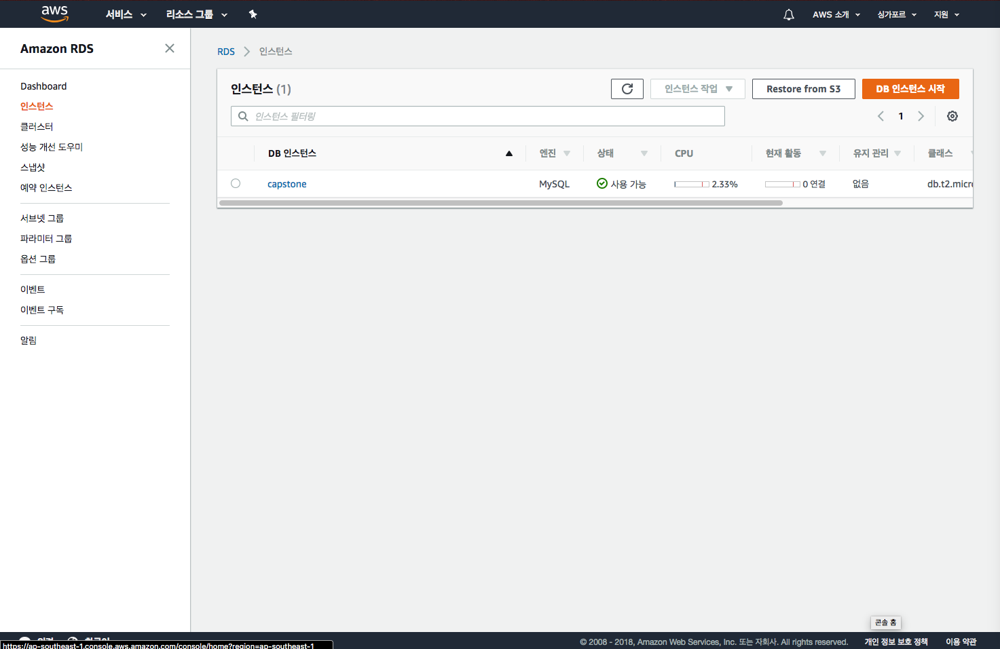
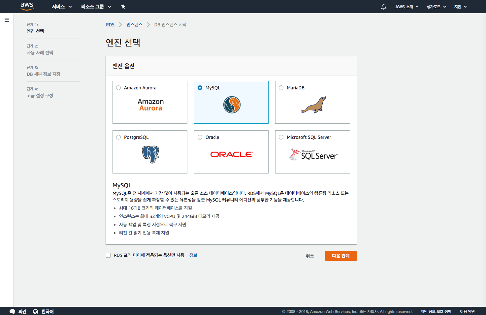
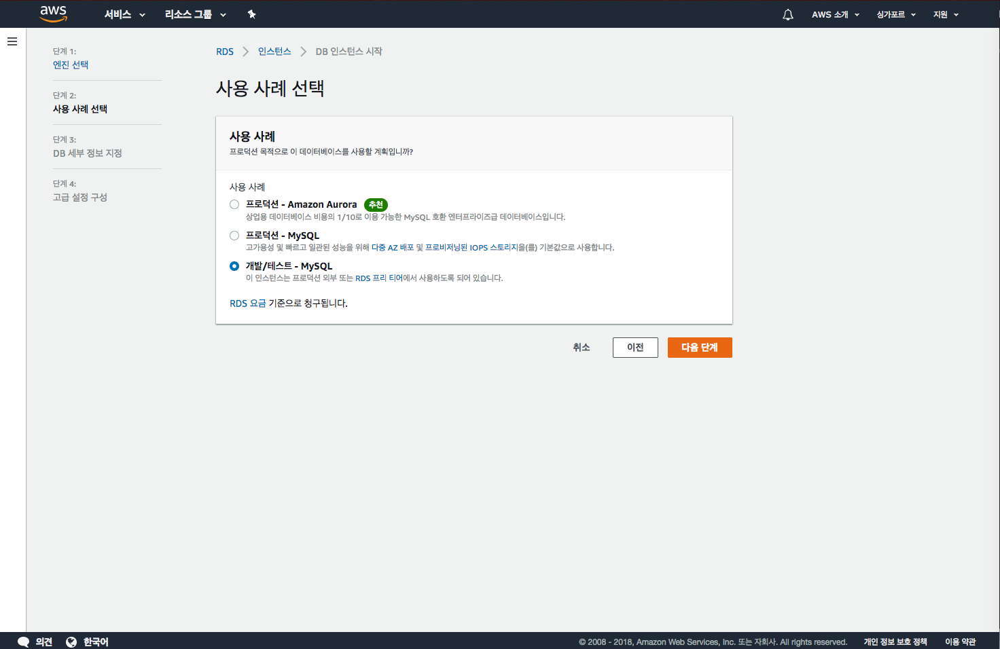
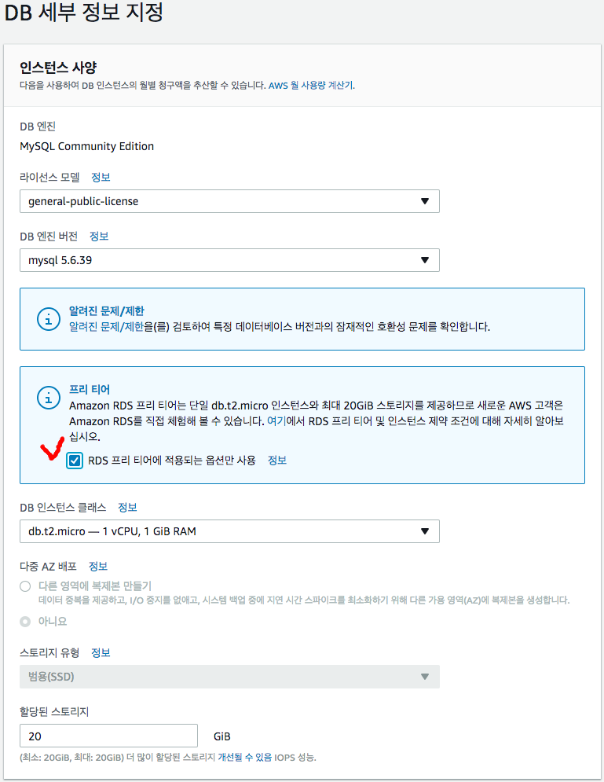
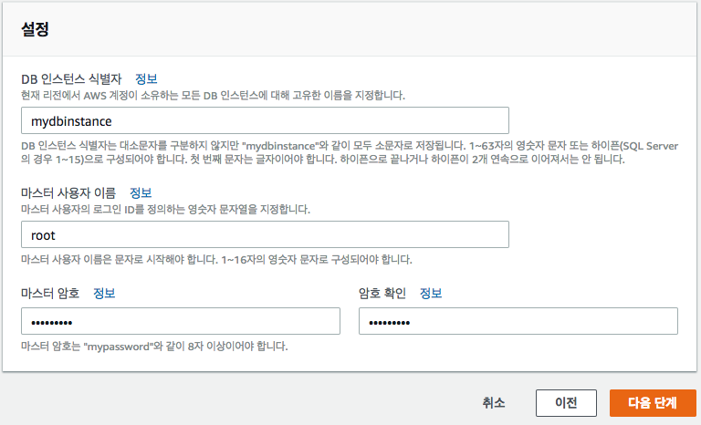
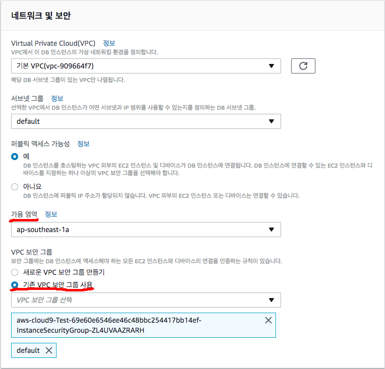
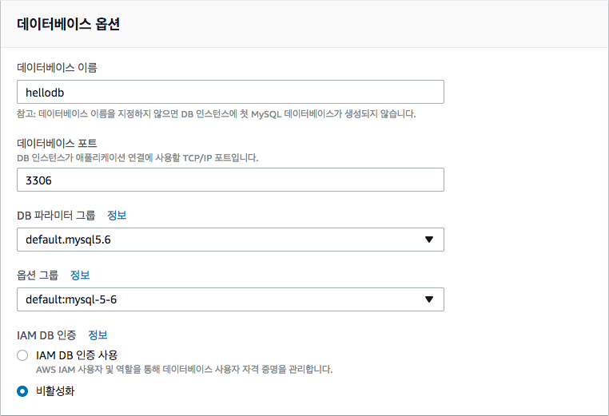

# AWS RDS

## RDS 생성하기
- AWS Console로 이동
- 싱가포르 리전으로 이동
- RDS 서비스로 이동

- 좌측 탭에서 인스턴스탭 선택
- 'DB 인스턴스 시작' 클릭

- MySQL 선택 -> 다음단계 클릭 

- 개발/테스트 - MySQL 선택 -> 다음단계 클릭

- 프리티어 타이틀의 **RDS 프리 티어에 적용되는 옵션만 사용** 체크

- 페이지 하단의 설정 파트로 이동합니다.
- DB 인스턴스 식별자에 DB 인스턴스의 이름을 입력합니다.
- 마스터 사용자 이름에 DB의 root계정으로 사용할 ID를 입력합니다.
- 마스터 암호와 암호확인에 DB root계정의 암호를 입력합니다.
- 다음단계 클릭

- 네트워크 및 보안 -> 가용영역 -> ap-southeast-1a 선택
- 네트워크 및 보안 -> 기존 VPC 보안 그룹 사용 체크 -> C9과 같은 이름을 가진 보안그룹 선택

- 데이터베이스 옵션 -> 이름에 hellodb를 입력합니다.

- DB 인스턴스 시작 클릭

실습이 완료되면 다음모듈인 [4. Node.js](../4_Node.js) 으로 이동하십시오